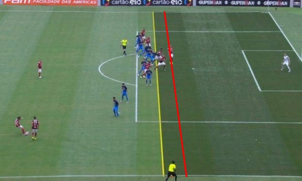
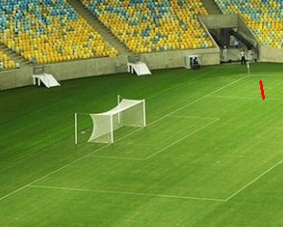

# Camera Calibration 🎥🧮
The purpose of this project is to implement perspective projections through camera calibration algorithms. 
Task developed for the Introduction to Computer Vision subject of Computer Science Bachelors at UFRGS on 2019.

## Applications ⚽
Today this algorithms and applications are very common and popular due to football and VAR (Video assistant referee) that assists football matches and draws offside lines do determine a valid position of a player or deny a goal on live broadcasts. 

### Offside Line:

  

### 3D Perspective Player Line:

  

## Run the project 🎡

The project was developed in MacOS using Python3 and opencv.
In both programs you simply have to click in the area of the image where you want to consider the point to draw the line. 
ESC to close de GUI window.

### Install dependencies: 
   run `pip install -r -requirements.txt`  

### Run offside line drawer program: 
   run `python3 offside_line_projection.py`  

### Run 3D perspective line drawer program: 
   run `python3 offside_line_projection.py` 

## Author 🧙‍♂️
- Andy Ruiz Garramones - [Andy9822](https://github.com/Andy9822)